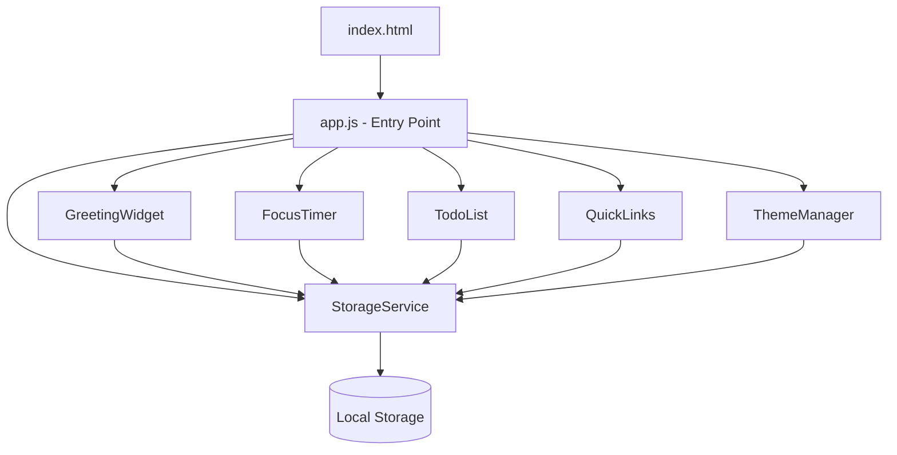

# Dokumen Desain: To-Do Life Dashboard

## Ikhtisar

To-Do Life Dashboard adalah halaman web statis satu halaman (single-page) yang dibangun dengan HTML, CSS, dan Vanilla JavaScript murni — tanpa framework, tanpa backend. Halaman ini menyatukan lima widget utama: Greeting Widget (jam, tanggal, sapaan), Focus Timer (Pomodoro), To-Do List, Quick Links, dan Theme Manager (light/dark mode). Semua data pengguna disimpan di sisi klien menggunakan Browser Local Storage API.

Tujuan desain utama:
- Tidak ada dependensi eksternal (berjalan offline setelah aset diunduh pertama kali)
- Satu file CSS, satu file JavaScript
- Semua state dikelola di memori dan disinkronkan ke Local Storage

---

## Arsitektur

Aplikasi menggunakan arsitektur **Module Pattern** berbasis Vanilla JS. Setiap widget direpresentasikan sebagai modul objek dengan metode `init()`, `render()`, dan handler-nya masing-masing. Satu file `app.js` bertindak sebagai entry point yang menginisialisasi semua modul.



**Alur inisialisasi:**
1. `ThemeManager.init()` dipanggil pertama untuk menerapkan tema sebelum render (mencegah FOUC)
2. `StorageService` memuat semua data dari Local Storage
3. Modul lain diinisialisasi secara berurutan dengan data yang sudah dimuat
4. Interval timer untuk `GreetingWidget` dan `FocusTimer` diaktifkan

---

## Komponen dan Antarmuka

### StorageService

Lapisan abstraksi tunggal untuk semua operasi Local Storage. Semua modul hanya berinteraksi dengan Local Storage melalui service ini.

```javascript
StorageService = {
  get(key),           // Mengembalikan parsed JSON atau null
  set(key, value),    // Menyimpan value sebagai JSON string
  isAvailable(),      // Mengembalikan boolean ketersediaan Local Storage
}
```

Kunci (key) yang digunakan:

| Key | Tipe Data | Deskripsi |
|-----|-----------|-----------|
| `tld_tasks` | `Task[]` | Array semua task |
| `tld_links` | `Link[]` | Array semua quick link |
| `tld_theme` | `string` | `"light"` atau `"dark"` |
| `tld_username` | `string` | Nama pengguna |
| `tld_pomodoro_duration` | `number` | Durasi Pomodoro dalam menit |

---

### GreetingWidget

Menampilkan jam, tanggal, dan sapaan. Menggunakan `setInterval` 1000ms untuk memperbarui tampilan.

```javascript
GreetingWidget = {
  init(),
  render(),
  getGreeting(hour),      // Mengembalikan string sapaan berdasarkan jam
  formatTime(date),       // Mengembalikan string "HH:MM"
  formatDate(date),       // Mengembalikan string "Senin, 14 Juli 2025"
  saveName(name),
}
```

Logika sapaan:

| Rentang Jam | Sapaan |
|-------------|--------|
| 05:00–11:59 | Selamat Pagi |
| 12:00–14:59 | Selamat Siang |
| 15:00–17:59 | Selamat Sore |
| 18:00–04:59 | Selamat Malam |

---

### FocusTimer

Countdown timer berbasis Pomodoro. State timer disimpan di memori (tidak di Local Storage) karena bersifat sementara.

```javascript
FocusTimer = {
  init(),
  start(),
  stop(),
  reset(),
  tick(),                 // Dipanggil setiap detik oleh setInterval
  formatTime(seconds),    // Mengembalikan string "MM:SS"
  validateDuration(min),  // Mengembalikan boolean (1–120)
  saveDuration(min),
  showCompletionNotice(), // Menampilkan notifikasi visual saat 00:00
}
```

State internal:

```javascript
{
  totalSeconds: number,   // Durasi saat ini dalam detik
  remainingSeconds: number,
  isRunning: boolean,
  intervalId: number | null,
}
```

---

### TodoList

Mengelola CRUD task. Setiap operasi langsung disinkronkan ke Local Storage.

```javascript
TodoList = {
  init(),
  render(),
  addTask(text),          // Validasi + tambah + simpan
  toggleTask(id),         // Toggle status selesai
  deleteTask(id),         // Hapus dari array + simpan
  editTask(id, newText),  // Update teks + simpan
  isValidText(text),      // Mengembalikan boolean (bukan whitespace-only)
  getIncompleteCount(),   // Mengembalikan jumlah task belum selesai
  save(),                 // Simpan state ke StorageService
}
```

---

### QuickLinks

Mengelola CRUD link. Validasi URL dan label dilakukan sebelum penyimpanan.

```javascript
QuickLinks = {
  init(),
  render(),
  addLink(label, url),    // Validasi + tambah + simpan
  deleteLink(id),
  isValidUrl(url),        // Harus diawali http:// atau https://
  isValidLabel(label),    // Bukan whitespace-only
  save(),
}
```

---

### ThemeManager

Mengelola toggle tema. Dipanggil pertama saat inisialisasi untuk mencegah FOUC.

```javascript
ThemeManager = {
  init(),                 // Baca dari storage, terapkan sebelum render
  toggle(),
  apply(theme),           // Menambah/hapus class pada <body>
  save(theme),
}
```

---

## Model Data

### Task

```javascript
{
  id: string,             // UUID atau timestamp-based ID
  text: string,           // Teks deskripsi tugas (non-empty, non-whitespace)
  completed: boolean,     // Status selesai
  createdAt: string,      // ISO 8601 timestamp
}
```

### Link

```javascript
{
  id: string,             // UUID atau timestamp-based ID
  label: string,          // Label tampilan (non-empty, non-whitespace)
  url: string,            // URL valid (diawali http:// atau https://)
}
```

### AppState (di memori)

```javascript
{
  tasks: Task[],
  links: Link[],
  theme: "light" | "dark",
  username: string | null,
  pomodoroDuration: number,   // dalam menit, default 25
}
```

---

## Correctness Properties

*A property is a characteristic or behavior that should hold true across all valid executions of a system — essentially, a formal statement about what the system should do. Properties serve as the bridge between human-readable specifications and machine-verifiable correctness guarantees.*

### Property 1: Format waktu selalu HH:MM

*Untuk sembarang* objek Date yang valid, `formatTime(date)` harus selalu mengembalikan string yang cocok dengan pola `HH:MM` di mana HH adalah jam dua digit (00–23) dan MM adalah menit dua digit (00–59), dan nilainya sesuai dengan jam dan menit dari Date tersebut.

**Validates: Requirements 1.1**

---

### Property 2: Format tanggal mengandung nama hari Bahasa Indonesia yang benar

*Untuk sembarang* objek Date yang valid, `formatDate(date)` harus selalu mengembalikan string yang mengandung nama hari dalam Bahasa Indonesia yang sesuai dengan hari dari Date tersebut (Senin, Selasa, Rabu, Kamis, Jumat, Sabtu, Minggu).

**Validates: Requirements 1.2**

---

### Property 3: Sapaan sesuai rentang jam

*Untuk sembarang* nilai jam (0–23), `getGreeting(hour)` harus mengembalikan sapaan yang tepat sesuai rentang: jam 5–11 → "Selamat Pagi", jam 12–14 → "Selamat Siang", jam 15–17 → "Selamat Sore", jam 18–23 dan 0–4 → "Selamat Malam". Tidak ada nilai jam yang valid yang boleh menghasilkan sapaan di luar keempat nilai tersebut.

**Validates: Requirements 1.3, 1.4, 1.5, 1.6**

---

### Property 4: Sapaan mengandung nama pengguna

*Untuk sembarang* nama pengguna yang valid (non-empty, non-whitespace), string sapaan yang dihasilkan harus selalu mengandung nama tersebut sebagai bagian dari teks sapaan.

**Validates: Requirements 1.7**

---

### Property 5: Round-trip penyimpanan nama pengguna

*Untuk sembarang* nama pengguna yang valid, memanggil `saveName(name)` kemudian membaca dari `StorageService` harus menghasilkan nilai yang identik dengan nama yang disimpan.

**Validates: Requirements 1.8**

---

### Property 6: Format timer selalu MM:SS

*Untuk sembarang* nilai detik yang valid (0–7200), `formatTime(seconds)` pada FocusTimer harus selalu mengembalikan string yang cocok dengan pola `MM:SS` di mana MM dan SS masing-masing adalah dua digit.

**Validates: Requirements 2.1**

---

### Property 7: Setiap tick mengurangi remainingSeconds tepat 1

*Untuk sembarang* state timer dengan `isRunning = true` dan `remainingSeconds > 0`, memanggil `tick()` harus selalu mengurangi `remainingSeconds` tepat sebesar 1.

**Validates: Requirements 2.6**

---

### Property 8: Reset mengembalikan timer ke durasi awal

*Untuk sembarang* durasi Pomodoro yang valid dan sembarang state timer (berjalan atau berhenti, dengan sisa waktu berapa pun), memanggil `reset()` harus selalu mengembalikan `remainingSeconds` ke nilai `totalSeconds` dan `isRunning` ke `false`.

**Validates: Requirements 2.4**

---

### Property 9: Round-trip penyimpanan durasi Pomodoro

*Untuk sembarang* durasi yang valid (1–120 menit), memanggil `saveDuration(min)` kemudian membaca dari `StorageService` harus menghasilkan nilai yang identik dengan durasi yang disimpan.

**Validates: Requirements 2.8**

---

### Property 10: Validasi durasi Pomodoro

*Untuk sembarang* nilai integer, `validateDuration(min)` harus mengembalikan `true` jika dan hanya jika nilai tersebut berada dalam rentang [1, 120]. Untuk sembarang nilai di luar rentang tersebut (termasuk 0, negatif, dan > 120), harus mengembalikan `false`.

**Validates: Requirements 2.9**

---

### Property 11: Validasi teks task (valid dan tidak valid)

*Untuk sembarang* string yang tidak kosong dan tidak hanya berisi whitespace, `isValidText(text)` harus mengembalikan `true` dan `addTask()` harus berhasil menambahkan task. *Untuk sembarang* string yang kosong atau hanya berisi whitespace, `isValidText(text)` harus mengembalikan `false` dan `addTask()` harus menolak penambahan tanpa mengubah state storage.

**Validates: Requirements 3.1, 3.6**

---

### Property 12: Round-trip toggle status task

*Untuk sembarang* task yang ada dalam daftar, memanggil `toggleTask(id)` harus selalu membalik nilai `completed` (true → false, false → true), dan perubahan tersebut harus terpersist di `StorageService`.

**Validates: Requirements 3.2**

---

### Property 13: Hapus task menghilangkan dari storage

*Untuk sembarang* task yang ada dalam daftar, setelah memanggil `deleteTask(id)`, task tersebut tidak boleh ditemukan dalam array yang dibaca dari `StorageService`.

**Validates: Requirements 3.3**

---

### Property 14: Edit task memperbarui teks di storage

*Untuk sembarang* task yang ada dan sembarang teks baru yang valid, setelah memanggil `editTask(id, newText)`, membaca task dari `StorageService` harus mengembalikan task dengan teks yang sama dengan `newText`.

**Validates: Requirements 3.4**

---

### Property 15: Load tasks dari storage adalah identitas

*Untuk sembarang* array task yang disimpan ke `StorageService`, memanggil `TodoList.init()` harus menghasilkan state internal yang identik dengan array yang disimpan (urutan dan semua field dipertahankan).

**Validates: Requirements 3.5**

---

### Property 16: Invariant jumlah task belum selesai

*Untuk sembarang* array task dengan kombinasi status `completed` yang acak, `getIncompleteCount()` harus selalu mengembalikan nilai yang sama persis dengan jumlah elemen yang memiliki `completed = false`.

**Validates: Requirements 3.7**

---

### Property 17: Round-trip tambah dan muat link

*Untuk sembarang* label dan URL yang valid, setelah memanggil `addLink(label, url)`, membaca dari `StorageService` harus menghasilkan array yang mengandung link dengan label dan URL yang identik.

**Validates: Requirements 4.1**

---

### Property 18: Hapus link menghilangkan dari storage

*Untuk sembarang* link yang ada dalam daftar, setelah memanggil `deleteLink(id)`, link tersebut tidak boleh ditemukan dalam array yang dibaca dari `StorageService`.

**Validates: Requirements 4.3**

---

### Property 19: Load links dari storage adalah identitas

*Untuk sembarang* array link yang disimpan ke `StorageService`, memanggil `QuickLinks.init()` harus menghasilkan state internal yang identik dengan array yang disimpan.

**Validates: Requirements 4.4**

---

### Property 20: Validasi input link (URL dan label)

*Untuk sembarang* string URL yang tidak diawali `http://` atau `https://`, `isValidUrl(url)` harus mengembalikan `false`. *Untuk sembarang* string label yang kosong atau hanya berisi whitespace, `isValidLabel(label)` harus mengembalikan `false`. Keduanya harus mengembalikan `true` untuk input yang valid.

**Validates: Requirements 4.5, 4.6**

---

### Property 21: Round-trip penyimpanan dan pemuatan tema

*Untuk sembarang* nilai tema (`"light"` atau `"dark"`), memanggil `ThemeManager.apply(theme)` kemudian membaca dari `StorageService` harus menghasilkan nilai yang identik. Selanjutnya, memanggil `ThemeManager.init()` dengan nilai tersebut di storage harus menerapkan class yang sesuai pada `<body>`.

**Validates: Requirements 5.4, 5.5**

---

### Property 22: Toggle tema adalah idempoten ganda (round-trip)

*Untuk sembarang* tema awal, memanggil `toggle()` dua kali berturut-turut harus mengembalikan tema ke nilai semula.

**Validates: Requirements 5.2, 5.3**

---

### Property 23: Konsistensi kunci Local Storage

*Untuk sembarang* operasi penyimpanan dari modul manapun, kunci yang digunakan harus selalu sama dengan konstanta yang didefinisikan (`tld_tasks`, `tld_links`, `tld_theme`, `tld_username`, `tld_pomodoro_duration`) dan tidak ada dua modul yang menggunakan kunci yang sama.

**Validates: Requirements 6.1**

---

## Penanganan Error

### StorageService tidak tersedia
- `StorageService.isAvailable()` dipanggil saat inisialisasi
- Jika `false`: semua operasi storage menjadi no-op, data disimpan hanya di memori
- Banner peringatan ditampilkan di bagian atas halaman

### Validasi input
- Semua validasi dilakukan di layer modul sebelum menyentuh storage
- Pesan error ditampilkan inline di dekat elemen input yang bermasalah
- State tidak berubah jika validasi gagal

### Timer edge cases
- `tick()` tidak dipanggil jika `isRunning = false`
- Saat `remainingSeconds` mencapai 0: `isRunning` diset `false`, interval dibersihkan, notifikasi ditampilkan
- `start()` tidak melakukan apapun jika timer sudah berjalan

### Data korup di Local Storage
- Jika `JSON.parse` gagal, `StorageService.get()` mengembalikan `null`
- Modul memperlakukan `null` sebagai state awal kosong (array kosong / nilai default)

---

## Strategi Pengujian

### Pendekatan Dual Testing

Pengujian menggunakan dua pendekatan komplementer:
1. **Unit test berbasis contoh**: untuk perilaku spesifik, edge case, dan kondisi error
2. **Property-based test**: untuk memverifikasi property universal di atas berbagai input acak

### Library Property-Based Testing

Gunakan **fast-check** (JavaScript) untuk semua property-based test.

```bash
npm install --save-dev fast-check
```

### Konfigurasi Property Test

Setiap property test dikonfigurasi dengan minimum **100 iterasi**. Tag format:

```javascript
// Feature: todo-life-dashboard, Property N: <teks property>
```

### Cakupan Unit Test

Unit test fokus pada:
- Contoh konkret untuk perilaku UI (buka tab baru, keberadaan elemen DOM)
- Edge case: storage tidak tersedia, timer habis, data korup
- Urutan inisialisasi (ThemeManager dipanggil pertama)

### Cakupan Property Test

Setiap property di bagian Correctness Properties diimplementasikan sebagai satu property-based test menggunakan fast-check. Generator yang dibutuhkan:

| Generator | Deskripsi |
|-----------|-----------|
| `fc.date()` | Objek Date acak untuk GreetingWidget |
| `fc.integer({min:0, max:23})` | Jam acak untuk getGreeting |
| `fc.integer({min:0, max:7200})` | Detik acak untuk formatTime timer |
| `fc.string().filter(s => s.trim().length > 0)` | Teks task/label valid |
| `fc.string()` | String acak termasuk whitespace-only |
| `fc.integer({min:1, max:120})` | Durasi Pomodoro valid |
| `fc.oneof(fc.constant('light'), fc.constant('dark'))` | Nilai tema |
| `fc.array(fc.record({...}))` | Array task/link acak |

### Smoke Test

- Verifikasi tidak ada request jaringan eksternal
- Verifikasi struktur file (satu CSS, satu JS)
- Verifikasi aplikasi tidak crash saat storage tidak tersedia
